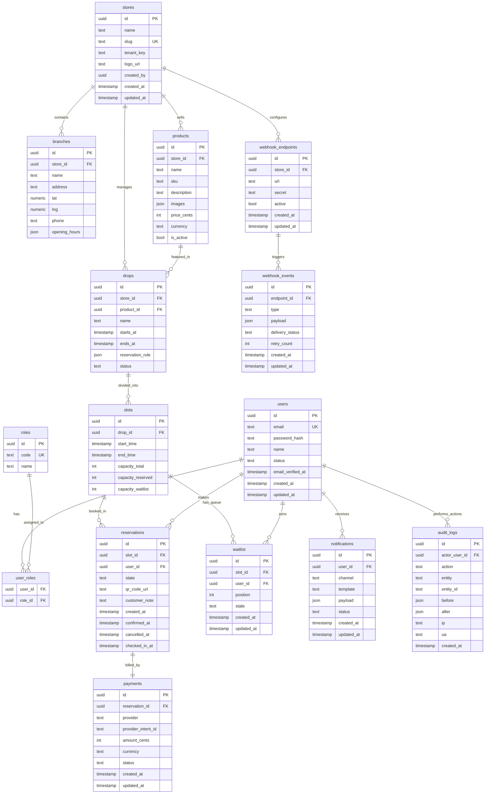

# DropSlot Database Design (Mermaid ER Diagram)

## Overview

This document contains the Entity-Relationship diagram for the DropSlot database schema, converted from PlantUML to Mermaid format for better integration with modern documentation tools.

## Database Schema



## Entity Descriptions

### Core Entities

#### Users
The central entity representing system users with authentication and profile information.
- **Primary Key**: `id` (UUID)
- **Unique Constraint**: `email`
- **Relationships**:
  - Many-to-many with `roles` through `user_roles`
  - One-to-many with `reservations`
  - One-to-many with `waitlist` entries
  - One-to-many with `notifications`
  - One-to-many with `audit_logs` (as actor)

#### Roles
Defines user roles and permissions in the system.
- **Primary Key**: `id` (UUID)
- **Unique Constraint**: `code`
- **Relationships**:
  - Many-to-many with `users` through `user_roles`

#### Stores
Represents retail stores with multi-tenant support.
- **Primary Key**: `id` (UUID)
- **Unique Constraint**: `slug`
- **Relationships**:
  - One-to-many with `branches`
  - One-to-many with `products`
  - One-to-many with `drops`
  - One-to-many with `webhook_endpoints`

#### Branches
Physical store locations with geographical information.
- **Primary Key**: `id` (UUID)
- **Foreign Key**: `store_id` → `stores.id`
- **Notable Fields**:
  - `lat`, `lng`: Geographic coordinates
  - `opening_hours`: JSON structure for flexible scheduling

### Product Management

#### Products
Catalog items with pricing and media information.
- **Primary Key**: `id` (UUID)
- **Foreign Key**: `store_id` → `stores.id`
- **Unique Constraint**: `sku` (per store)
- **Notable Fields**:
  - `images`: JSON array of image URLs
  - `price_cents`: Integer for precise currency handling
- **Relationships**:
  - One-to-many with `drops`

#### Drops
Time-boxed product release events.
- **Primary Key**: `id` (UUID)
- **Foreign Keys**:
  - `store_id` → `stores.id`
  - `product_id` → `products.id`
- **Notable Fields**:
  - `starts_at`, `ends_at`: Event time window
  - `reservation_rule`: JSON configuration for booking rules
- **Relationships**:
  - One-to-many with `slots`

#### Slots
Specific time slots within drops with capacity management.
- **Primary Key**: `id` (UUID)
- **Foreign Key**: `drop_id` → `drops.id`
- **Notable Fields**:
  - `capacity_total`: Maximum bookings allowed
  - `capacity_reserved`: Current confirmed reservations
  - `capacity_waitlist`: Current waitlist entries
- **Relationships**:
  - One-to-many with `reservations`
  - One-to-many with `waitlist` entries

### Booking System

#### Reservations
Confirmed bookings with state management.
- **Primary Key**: `id` (UUID)
- **Foreign Keys**:
  - `slot_id` → `slots.id`
  - `user_id` → `users.id`
- **Notable Fields**:
  - `state`: PENDING → CONFIRMED → CHECKED_IN/CANCELLED/EXPIRED
  - `qr_code_url`: Generated QR code for check-in
- **Relationships**:
  - One-to-one with `payments`

#### Waitlist
Queue system for oversubscribed slots.
- **Primary Key**: `id` (UUID)
- **Foreign Keys**:
  - `slot_id` → `slots.id`
  - `user_id` → `users.id`
- **Notable Fields**:
  - `position`: Queue position for fair ordering

### Supporting Entities

#### Payments
Financial transaction records.
- **Primary Key**: `id` (UUID)
- **Foreign Key**: `reservation_id` → `reservations.id` (unique)
- **Notable Fields**:
  - `provider_intent_id`: External payment processor reference
  - `amount_cents`: Precise monetary amounts

#### Notifications
Communication records for user notifications.
- **Primary Key**: `id` (UUID)
- **Foreign Key**: `user_id` → `users.id`
- **Notable Fields**:
  - `channel`: email, push, sms, etc.
  - `payload`: JSON data for template rendering

#### Webhook Endpoints
External integration configuration.
- **Primary Key**: `id` (UUID)
- **Foreign Key**: `store_id` → `stores.id`
- **Notable Fields**:
  - `secret`: HMAC signature validation
- **Relationships**:
  - One-to-many with `webhook_events`

#### Webhook Events
Outbound event delivery tracking.
- **Primary Key**: `id` (UUID)
- **Foreign Key**: `endpoint_id` → `webhook_endpoints.id`
- **Notable Fields**:
  - `retry_count`: Failed delivery retry tracking
  - `delivery_status`: Success/failure/pending states

#### Audit Logs
Comprehensive system activity tracking.
- **Primary Key**: `id` (UUID)
- **Foreign Key**: `actor_user_id` → `users.id`
- **Notable Fields**:
  - `before`, `after`: JSON snapshots for change tracking
  - `ip`, `ua`: Client identification for security

## Key Design Patterns

### Multi-Tenancy
- `tenant_key` in stores enables data isolation
- Row-level security policies should be implemented at the database level

### State Management
- Reservation states follow a clear lifecycle
- Audit logs track all state changes for compliance

### Capacity Management
- Slots track three capacity types: total, reserved, waitlist
- Business logic ensures reserved + waitlist ≤ total

### Temporal Data
- Extensive use of timestamps for audit trails
- Time-based queries optimized with proper indexing

### JSON Flexibility
- `reservation_rule`, `opening_hours`, `images`, etc. use JSON
- Allows schema evolution without database migrations

## Indexing Strategy

### Recommended Indexes
```sql
-- User lookups
CREATE INDEX idx_users_email ON users(email);
CREATE INDEX idx_users_status ON users(status);

-- Store queries
CREATE INDEX idx_stores_slug ON stores(slug);
CREATE INDEX idx_stores_tenant_key ON stores(tenant_key);

-- Product searches
CREATE INDEX idx_products_store_id ON products(store_id);
CREATE INDEX idx_products_sku ON products(store_id, sku);

-- Drop queries
CREATE INDEX idx_drops_store_id ON drops(store_id);
CREATE INDEX idx_drops_product_id ON products(product_id);
CREATE INDEX idx_drops_status ON drops(status);
CREATE INDEX idx_drops_time_window ON drops(starts_at, ends_at);

-- Slot queries
CREATE INDEX idx_slots_drop_id ON slots(drop_id);
CREATE INDEX idx_slots_time_window ON slots(start_time, end_time);

-- Reservation queries
CREATE INDEX idx_reservations_slot_id ON reservations(slot_id);
CREATE INDEX idx_reservations_user_id ON reservations(user_id);
CREATE INDEX idx_reservations_state ON reservations(state);

-- Waitlist queries
CREATE INDEX idx_waitlist_slot_id ON waitlist(slot_id);
CREATE INDEX idx_waitlist_user_id ON waitlist(user_id);

-- Audit logs
CREATE INDEX idx_audit_logs_actor ON audit_logs(actor_user_id);
CREATE INDEX idx_audit_logs_entity ON audit_logs(entity, entity_id);
CREATE INDEX idx_audit_logs_created_at ON audit_logs(created_at);
```

## Data Integrity Constraints

### Unique Constraints
- Users: email must be unique
- Roles: code must be unique
- Stores: slug must be unique
- Products: (store_id, sku) must be unique
- Reservations: (user_id, slot_id) - one reservation per user per slot
- Waitlist: (user_id, slot_id) - one waitlist entry per user per slot
- Payments: reservation_id must be unique (one payment per reservation)

### Foreign Key Constraints
All foreign key relationships should have CASCADE or RESTRICT delete behavior based on business rules.

### Check Constraints
- Capacities must be non-negative
- End times must be after start times
- Reservation states must be valid enum values

## Performance Considerations

### Query Optimization
- Use composite indexes for common query patterns
- Consider partitioning for large tables (audit_logs, notifications)
- Implement proper connection pooling

### Caching Strategy
- Redis for session management and rate limiting
- Cache frequently accessed data (store info, product catalogs)
- Implement cache invalidation strategies

### Archival Strategy
- Implement data archival for old audit logs
- Consider table partitioning for time-series data
- Plan for data retention policies

This database design provides a solid foundation for the DropSlot platform, supporting the core requirements while allowing for future enhancements and scalability.